# 🛡️ RESTRICTED NEWS SEARCH AI 🔎

**A Multi-Agent System for Secure, Source-Restricted News Analysis**

  <a href="#-about-the-project">About</a> •
  <a href="#-core-features">Features</a> •
  <a href="#%EF%B8%8F-system-architecture">Workflow</a> •
  <a href="#-the-agent-team">The Agents</a> •
  <a href="#-getting-started">Getting Started</a>

    
    
    

---

## 🎯 About The Project

> In an era of information overload and misinformation, InsightEngine provides a robust solution for generating reliable, verifiable intelligence. This project uses a sophisticated multi-agent system to conduct deep-dive research on any topic, with a critical constraint: all information is sourced exclusively from a pre-approved, hard-coded list of trusted websites.
>
> It ensures that every piece of data in the final report is traceable, compliant, and free from the noise of the open internet.

### ✨ Core Features

- **🛡️ Strict Source Control:** The system's primary directive. The root agent is forbidden from searching the web and can only delegate tasks to sub-agents, which are locked to specific domains.
- **🔎 Multi-Layered Verification:** Each news-gathering agent has a built-in `after_model_call` to validate its findings, and the root agent performs a final screening, ensuring unparalleled source compliance.
- **🤖 Autonomous Workflow:** From keyword extraction to final report generation, the entire process is orchestrated by the `deep_search_agent` without manual intervention.
- **📄 Structured & Actionable Output:** Delivers a clean, consistently formatted report, making the insights easy to consume and act upon.

---

## ⚙️ System Architecture

The `deep_search_agent` orchestrates a precise, multi-step workflow to ensure data integrity and compliance.

```mermaid
graph TD
    style UserInput fill:#5DADE2,stroke:#333,stroke-width:2px,color:#fff
    style RootAgent fill:#8E44AD,stroke:#333,stroke-width:2px,color:#fff
    style KeywordAgent fill:#1ABC9C,stroke:#333,stroke-width:2px,color:#fff
    style NewsAgents fill:#F39C12,stroke:#333,stroke-width:2px,color:#fff
    style Verification fill:#E74C3C,stroke:#333,stroke-width:2px,color:#fff
    style FinalReport fill:#2ECC71,stroke:#333,stroke-width:2px,color:#fff

    UserInput(👤 User Query) --> RootAgent(🤖 deep_search_agent);

    subgraph "Step 1: Keyword Extraction"
        RootAgent -- Query --> KeywordAgent(🔎 define_search_agent);
        KeywordAgent -- Definition & Keywords --> RootAgent;
    end

    subgraph "Step 2: Restricted Information Gathering"
        RootAgent -- Keywords --> NewsAgents["newsA_agent
newsB_agent
newsC_agent"];
    end

    subgraph "Step 3: Multi-Layered Verification"
        NewsAgents -- Raw Articles --> Verification["🛡️ Internal URL Check
[After Model Callback]"];
        Verification -- Validated Articles --> RootAgent;
    end
    
    subgraph "Step 4: Final Report Generation"
        RootAgent -- "Final Screening & Aggregation" --> FinalReport(📄 Structured Report);
    end

    classDef default font-family: 'Helvetica', sans-serif;
```

