# 🛡️ RESTRICTED NEWS SEARCH AI 🔎

**A Multi-Agent System for Secure, Source-Restricted News Analysis**

  <a href="#-about-the-project">About</a> •
  <a href="#-core-features">Features</a> •
  <a href="#%EF%B8%8F-system-architecture">Workflow</a> •
  <a href="#-the-agent-team">The Agents</a> •
  <a href="#-getting-started">Getting Started</a>

    
    
    

---

## 🎯 About The Project

> In an era of information overload and misinformation, InsightEngine provides a robust solution for generating reliable, verifiable intelligence. This project uses a sophisticated multi-agent system to conduct deep-dive research on any topic, with a critical constraint: all information is sourced exclusively from a pre-approved, hard-coded list of trusted websites.
>
> It ensures that every piece of data in the final report is traceable, compliant, and free from the noise of the open internet.

### ✨ Core Features

- **🛡️ Strict Source Control:** The system's primary directive. The root agent is forbidden from searching the web and can only delegate tasks to sub-agents, which are locked to specific domains.
- **🔎 Multi-Layered Verification:** Each news-gathering agent has a built-in `after_model_call` to validate its findings, and the root agent performs a final screening, ensuring unparalleled source compliance.
- **🤖 Autonomous Workflow:** From keyword extraction to final report generation, the entire process is orchestrated by the `deep_search_agent` without manual intervention.
- **📄 Structured & Actionable Output:** Delivers a clean, consistently formatted report, making the insights easy to consume and act upon.

---

## ⚙️ System Architecture

The `deep_search_agent` orchestrates a precise, multi-step workflow to ensure data integrity and compliance.

```mermaid
graph TD
    style UserInput fill:#5DADE2,stroke:#333,stroke-width:2px,color:#fff
    style RootAgent fill:#8E44AD,stroke:#333,stroke-width:2px,color:#fff
    style KeywordAgent fill:#1ABC9C,stroke:#333,stroke-width:2px,color:#fff
    style NewsAgents fill:#F39C12,stroke:#333,stroke-width:2px,color:#fff
    style Verification fill:#E74C3C,stroke:#333,stroke-width:2px,color:#fff
    style FinalReport fill:#2ECC71,stroke:#333,stroke-width:2px,color:#fff

    UserInput(👤 User Query) --> RootAgent(🤖 deep_search_agent);

    subgraph "Step 1: Keyword Extraction"
        RootAgent -- Query --> KeywordAgent(🔎 define_search_agent);
        KeywordAgent -- Definition & Keywords --> RootAgent;
    end

    subgraph "Step 2: Restricted Information Gathering"
        RootAgent -- Keywords --> NewsAgents["newsA_agent
newsB_agent
newsC_agent"];
    end

    subgraph "Step 3: Multi-Layered Verification"
        NewsAgents -- Raw Articles --> Verification["🛡️ Internal URL Check
[After Model Callback]"];
        Verification -- Validated Articles --> RootAgent;
    end
    
    subgraph "Step 4: Final Report Generation"
        RootAgent -- "Final Screening & Aggregation" --> FinalReport(📄 Structured Report);
    end

    classDef default font-family: 'Helvetica', sans-serif;
```

🤝 The Agent Team
Our system is composed of a powerful team of agents, each with a highly specialized and restricted role.

🟣 deep_search_agent (The Orchestrator)
Role: Root Agent

Function: Acts as the central brain and project manager. It interprets the user's query, manages the entire workflow, delegates tasks to sub-agents, and assembles the final, compliant report. It is strictly forbidden from accessing any external news sources itself.

🔎 define_search_agent (The Keyword Specialist)
Role: Sub-Agent

Function: This agent's sole purpose is to analyze the user's initial topic, provide a concise definition, and extract the 3-5 most essential keywords for the search. This ensures the subsequent search is focused and relevant.

📰 newsA_agent (Financial News Agent)
Role: Sub-Agent / Information Gatherer

Function: Searches for news articles using the provided keywords, but is strictly confined to the following domains:

https://www.aastocks.com/en/
https://hk.investing.com
📈 newsB_agent (Regional News Agent)
Role: Sub-Agent / Information Gatherer

Function: Searches for news articles using the provided keywords, but is strictly confined to the following domains:

https://www.aastocks.com/tc/stocks/news/aafn
https://news.cnyes.com
🌐 newsC_agent (Market News Agent)
Role: Sub-Agent / Information Gatherer

Function: Searches for news articles using the provided keywords, but is strictly confined to the following domains:

https://www.etnet.com.hk/www/tc/news/index.php
https://inews.hket.com
📄 Example Output

 
<strong>🚀 Click to see a sample report for the topic: "recent developments in Chinese electric vehicles"</strong>

Article 1:

Title: BYD Launches New Blade Battery with 1000km Range, Intensifying Price War
Publication Date: 2024-05-15
Summary: This article details the recent launch of BYD's second-generation "Blade Battery," a significant technological advancement. It directly addresses the keywords "BYD" and "price war" by explaining how this new, more efficient battery technology will allow BYD to lower production costs for its electric vehicles, putting further pressure on competitors like NIO and XPeng. The summary highlights the impact on the broader "EV exports" market, as BYD aims to leverage this technology to expand its footprint in Europe and Southeast Asia.
URL: https://hk.investing.com/news/stock-market-news/byd-launches-new-blade-battery-21345

Article 2:

Title: NIO Secures $2.2 Billion Investment from Abu Dhabi Fund to Fuel R&D
Publication Date: 2024-05-12
Summary: This report focuses on a major capital injection for NIO, a key player in China's EV market. The article explicitly covers the keyword "NIO" and touches upon its strategy to compete in the high-end segment. The funds are earmarked for developing next-generation technologies, including semi-"solid-state batteries" and autonomous driving systems, which are crucial for staying competitive against domestic and international rivals.
URL: https://www.aastocks.com/en/stocks/news/aafn-news/NOW.1234567
